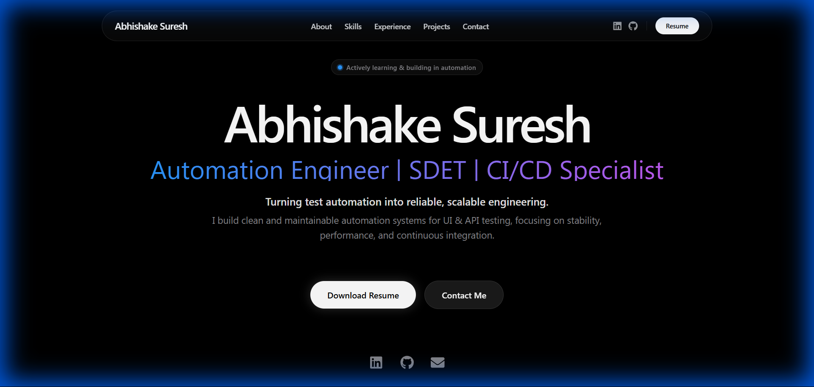

# 🚀 Abhishake Suresh - QA Engineer Portfolio

A modern, performant portfolio website built with Next.js, showcasing my skills and experience as a QA Automation Engineer.


## 🌐 Live Demo

**[abhishakesuresh.netlify.app](https://abhishakesuresh.netlify.app/)**

## 📸 Preview



## ✨ Features

- **Responsive Design** - Optimized for all devices (mobile, tablet, desktop)
- **Dark Theme** - Sleek cinematic tech noir aesthetic
- **Smooth Animations** - Scroll-triggered animations with Framer Motion
- **Performance Optimized** - Dynamic imports, lazy loading, optimized images
- **Accessibility** - WCAG compliant with proper ARIA labels
- **SEO Ready** - Meta tags, semantic HTML, structured data

## 🛠️ Tech Stack

| Category | Technologies |
|----------|-------------|
| **Framework** | Next.js 15 (App Router) |
| **Language** | TypeScript |
| **Styling** | Tailwind CSS |
| **Animations** | Framer Motion |
| **Icons** | React Icons |
| **Deployment** | Netlify |

## 📂 Project Structure

```
src/
├── app/
│   ├── layout.tsx      # Root layout with metadata
│   ├── page.tsx        # Main page with lazy-loaded components
│   ├── globals.css     # Global styles & Tailwind config
│   ├── not-found.tsx   # Custom 404 page
│   └── error.tsx       # Error boundary
├── components/
│   ├── Hero.tsx        # Hero section
│   ├── About.tsx       # About me section
│   ├── Skills.tsx      # Technical skills
│   ├── Experience.tsx  # Work experience
│   ├── Projects.tsx    # Featured projects
│   ├── Achievements.tsx # Key achievements
│   ├── Contact.tsx     # Contact information
│   └── Footer.tsx      # Footer
```

## 🚀 Getting Started

### Prerequisites
- Node.js 18+ 
- npm or yarn

### Installation

```bash
# Clone the repository
git clone https://github.com/abhishakesuresh/portfolio.git

# Navigate to project
cd portfolio

# Install dependencies
npm install

# Run development server
npm run dev
```

Open [http://localhost:3000](http://localhost:3000) to view the site.

### Build for Production

```bash
npm run build
npm start
```

## 📊 Lighthouse Scores

| Metric | Score |
|--------|-------|
| Performance | 98 |
| Accessibility | 90+ |
| Best Practices | 100 |
| SEO | 100 |

## 📧 Contact

- **Email:** abhishake.suresh@gmail.com
- **LinkedIn:** [linkedin.com/in/abhishakesuresh](https://linkedin.com/in/abhishakesuresh)
- **GitHub:** [github.com/abhishakesuresh](https://github.com/abhishakesuresh)

---

<p align="center">
  Built with ❤️ by Abhishake Suresh
</p>
